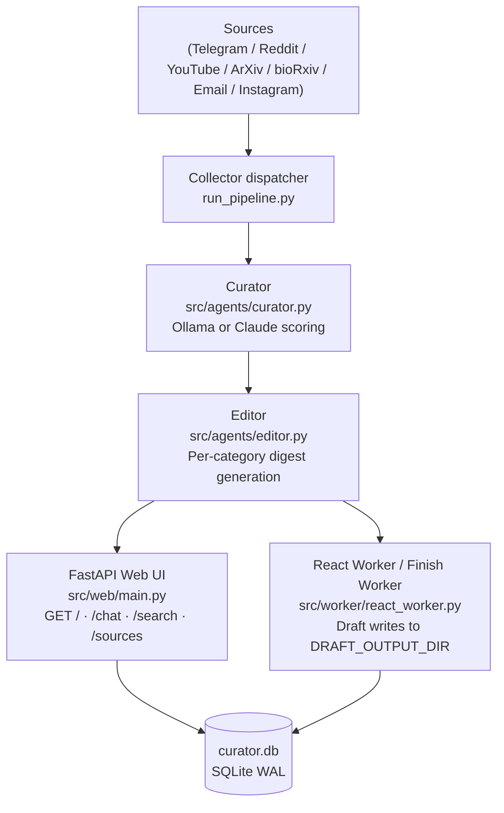

# autorss_feed

A self-hosted personal content curator that collects posts from Telegram channels,
Reddit, YouTube, ArXiv, bioRxiv, email newsletters, and Instagram; scores them with
a local LLM (Ollama) or Claude; assembles twice-daily digests; and exposes a
FastAPI web UI with a RAG-powered "ask your feed" chat. Everything runs locally —
no third-party feed service, no cloud database.

## Architecture



## Quick Start

### Prerequisites

- Python 3.12+
- [uv](https://github.com/astral-sh/uv) (`pip install uv`)
- [Ollama](https://ollama.com) running locally

### Steps

1. **Install dependencies**

   ```bash
   pip install uv
   uv sync
   ```

2. **Configure**

   ```bash
   cp .env.example .env
   # Edit .env: set TG_API_ID + TG_API_HASH for live Telegram collection,
   # or leave them blank to test with seeded data only.
   ```

3. **Start Ollama** (required for AI curation)

   ```bash
   ollama pull qwen2.5:7b
   # Ollama serves automatically after pull, or run: ollama serve
   ```

4. **Seed test data and run the pipeline** (no Telegram auth required)

   ```bash
   python run_pipeline.py --mode curate-only --seed-test-data
   ```

   This inserts five built-in test posts, scores them, and writes a digest to
   `curator.db`. Expect output ending with `OK | ...digest=created`.

   > **Note:** `--no-collect` is a deprecated alias; use `--mode curate-only --seed-test-data` for all new setups.

5. **Open the web UI**

   ```bash
   python -m uvicorn src.web.main:app --reload
   # Visit http://localhost:8000
      ```

   The main feed shows the digest. Use `/chat` for RAG queries over curated posts,
   `/sources` to manage collection targets, and `/search` for full-text semantic search.

## Configuration

All options are set via environment variables (or `.env`). Below is the complete
reference for the generic configuration surface.

| Variable | Default | Purpose |
|-|-|-|
| `CURATOR_BACKEND` | `ollama` | LLM backend for scoring: `ollama` \| `claude` \| `claude-batch` |
| `CURATOR_THRESHOLD` | `75` | Score floor (0-100) for `curated` status |
| `CURATOR_MODEL` | `qwen2.5:7b` | Ollama model used for curation |
| `OLLAMA_HOST` | `http://localhost:11434` | Ollama API base URL |
| `EDITOR_BACKEND_{CAT}` | *(routed)* | Per-category editor backend override, e.g. `EDITOR_BACKEND_AI=ollama` |
| `OBSIDIAN_PROFILE_DIR` | `profile/` | Directory containing your personal profile files |
| `DRAFT_OUTPUT_DIR` | `vault/10_Drafts` | Output directory for react/finish worker drafts |
| `PROFILE_CRITICAL_FILES` | `fact_dossier.md,...` | Comma-separated critical profile filenames |
| `PROFILE_ADVISORY_FILES` | `goals.md,...` | Comma-separated advisory profile filenames |
| `DB_PATH` | `curator.db` | SQLite database path |
| `TG_API_ID` | — | Telegram API ID (https://my.telegram.org/apps) |
| `TG_API_HASH` | — | Telegram API hash |
| `VISION_MODEL` | *(disabled)* | Ollama vision model for OCR fallback (e.g. `moondream`) |
| `VOICE_DIGEST_VOICE` | `ru-RU-DmitryNeural` | edge-tts voice for audio digest (Russian default; set e.g. `en-US-GuyNeural` for English) |

See `.env.example` for the full list including optional collectors (Email, Instagram,
ChromaDB cluster pre-filter).

## Running Tests

```bash
.venv/Scripts/python.exe -m pytest --tb=short
```

The test suite is fully offline — no Telegram auth, no Ollama required. Integration
tests that need a database use an in-memory SQLite fixture.

## Telegram Collection (optional)

Live Telegram collection requires a one-time interactive auth step (needs a TTY):

```bash
python scripts/auth_telegram.py
```

After auth, the `telegram_session.session` file is created and reused automatically.
Add source channels to `config/sources.txt` (format: `@channel | category | Display Name`).

## Status / Support

This project is provided **as-is**, with no roadmap commitments, no support SLA,
and no guarantees of backward compatibility. It is a personal productivity tool
released as open source for reference. Issues and pull requests are welcome but
may not receive a timely response.

## License

MIT — see [LICENSE](LICENSE).
